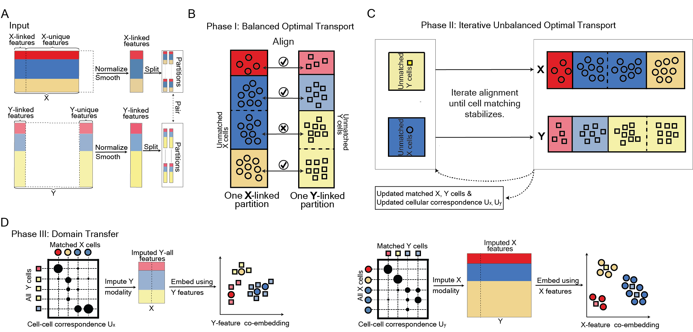

# CelLink: Integrate single-cell multi-omics data with few linked features and imbalanced cell populations


## About CelLink
CelLink is a Python package designed for single-cell multi-omics integration. It excels uniquely in integrating datasets with weak feature linkage and imbalanced cell populations. CelLink normalizes and smooths feature profiles to align scales across datasets and integrates them through a multi-phase pipeline that iteratively employs the optimal transport algorithm. It dynamically refines cell-cell correspondences, identifying and excluding cells that cannot be reliably matched, thus avoiding performance degradation caused by erroneous imputations. A classic example of weak linkage is seen in the integration of scRNA-seq and CODEX (spatial proteomic data) from the Human Pancreas Analysis Program (HPAP). 



## Novel capabilities of CelLink 
CelLink uniquely enables cell subtype annotation, correction of mislabelled cells, and spatial transcriptomic analyses by imputing transcriptomic profiles for spatial proteomics data. Its great ability to impute large-scale paired single-cell multi-omics profiles positions it as a pivotal tool for building single-cell multi-modal foundation models.


## Installation
Cellink can be installed from PyPI using pip. For best practices, create a new virtual environment before installation. Below, we demonstrate how to set up this environment using conda.

```bash
conda create -n CelLink python=3.9
conda activate CelLink
pip install CelLink
